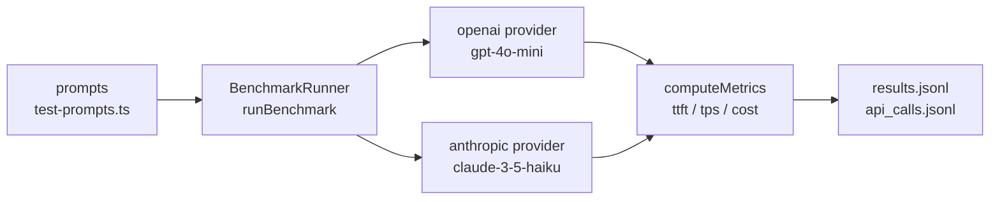

# Quickdraw

**Benchmark LLM streaming. TTFT, TPS, $/1K tokens. Across providers, on your prompts, with a hard cost ceiling.**

CLI + library for measuring time-to-first-token and tokens-per-second when streaming from OpenAI or Anthropic. Runs your prompts against live models, captures the metrics, and stops when a cost ceiling is hit.

---

## The problem

LLM SDKs give you a latency number but not a streaming breakdown. "Total time to first token" vs "time after last token" vs "throughput in tokens/sec" are different numbers that tell you different things. Quickdraw splits the stream into phases and gives you each one.

---

## How it works



`runBenchmark()` iterates over `providers[]`, streams each prompt, measures TTFT and TPS, writes `api_calls.jsonl` with raw data, and computes summary stats.

**Metrics captured per run:**

| Metric | Description |
|---|---|
| `ttft_ms` | Milliseconds from request start to first token received |
| `tps` | Tokens per second after first token |
| `total_duration_ms` | Full end-to-end time |
| `cost_usd` | Computed from token counts × provider pricing |
| `guardrail_overhead_ms` | Time spent in per-chunk callbacks |

---

## Usage

```bash
# Install
npm install -g @ykstormsorg/quickdraw

# Run against both providers, 3 runs each, $2 hard cost cap
quickdraw bench --providers openai,anthropic --runs 3 --cost-cap 2

# Dry run (no API calls, tests infrastructure only)
DRY_RUN=true quickdraw bench --providers openai --runs 1
```

**Library mode:**

```typescript
import { runBenchmark } from '@ykstormsorg/quickdraw'

const results = await runBenchmark({
  providers: ['openai', 'anthropic'],
  runs: 3,
  guardrails: false,
})
// results: BenchmarkResult[] with per-provider stream metrics
```

---

## Stack

| Layer | Choice |
|---|---|
| Runtime | Node.js 18+ |
| Types | TypeScript |
| Build | tsup |
| Tests | Vitest |
| Providers | OpenAI SDK + Anthropic SDK |
| License | Apache 2.0 |

~403 LOC.

---

## What's NOT here

- **No Bedrock / Vertex / Gemini support.** Only OpenAI and Anthropic v1 SDKs. Azure and local models are not wired.
- **No nightly dashboard yet.** The nightly workflow is wired (`0 3 * * *`) but results are written to workflow logs, not a hosted dashboard. Coming soon.
- **No percentile reporting.** Currently reports averages across runs. p50/p95/p99 require computation over `api_calls.jsonl` which isn't wired into the summary yet.
- **No regression diffing.** `results.jsonl` is written but there's no `quickdraw diff` command to compare two benchmark runs.
- **Guardrail overhead is a stub.** `guardrail_overhead_ms` is measured with a no-op callback — it doesn't run real Tripwire patterns.

---

## Try locally

```bash
git clone https://github.com/ykstorm/quickdraw.git
cd quickdraw
npm install
npm test                    # vitest suite
DRY_RUN=true npm run bench  # dry run against mock infra
# Then with real keys:
export OPENAI_API_KEY=sk-...
export ANTHROPIC_API_KEY=sk-ant-...
npm run bench               # live against OpenAI + Anthropic
```

---

## License

Apache 2.0 — see [LICENSE](LICENSE).
