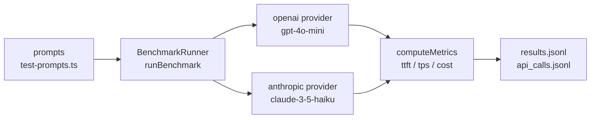

# Quickdraw

**Benchmark LLM streaming — TTFT, TPS, $/1K tokens. Across providers, on your prompts, with a hard cost ceiling.**

[](https://github.com/ykstorm/quickdraw/actions/workflows/ci.yml)
[](https://www.npmjs.com/package/@ykstormsorg/quickdraw)
[](LICENSE)

---

## The problem

LLM SDKs give you a latency number but not a streaming breakdown. "Total time to first token" vs "time after last token" vs "throughput in tokens/sec" are different numbers that tell you different things. Quickdraw splits the stream into phases and gives you each one.

---

## How it works



`runBenchmark()` iterates over `providers[]`, streams each prompt, measures TTFT and TPS, writes `api_calls.jsonl` with raw data, and computes summary stats.

**Metrics captured per run:**

| Metric | Description |
|---|---|
| `ttft_ms` | Milliseconds from request start to first token received |
| `tps` | Tokens per second after first token |
| `total_duration_ms` | Full end-to-end time |
| `cost_usd` | Computed from token counts × provider pricing |
| `guardrail_overhead_ms` | Time spent in per-chunk callbacks |

---

## Quick start

```bash
# Install
npm install -g @ykstormsorg/quickdraw

# Run against both providers, 3 runs each, $2 hard cost cap
quickdraw bench --providers openai,anthropic --runs 3 --cost-cap 2

# Use your own prompt and save the full results JSON
quickdraw bench --providers openai --runs 5 --prompt-file ./bench/standard-prompt.md --json run.json

# Dry run (no API calls, prints the plan only)
DRY_RUN=true quickdraw bench --providers openai --runs 1

# Regression-diff two saved runs (exit code 2 if a regression is detected)
quickdraw diff baseline.json candidate.json
```

The benchmark table reports **avg / p50 / p95 / p99** for both TTFT and TPS, plus
per-provider cost. If a required API key is missing, the CLI exits with a clean
`Set OPENAI_API_KEY` / `Set ANTHROPIC_API_KEY` message and makes no network call.

### Try locally

```bash
git clone https://github.com/ykstorm/quickdraw.git
cd quickdraw
npm install
npm test                    # vitest suite
DRY_RUN=true npm run bench  # dry run against mock infra
# Then with real keys:
export OPENAI_API_KEY=sk-...
export ANTHROPIC_API_KEY=sk-ant-...
npm run bench               # live against OpenAI + Anthropic
```

---

## Library mode

```typescript
import { runBenchmark } from '@ykstormsorg/quickdraw'

const results = await runBenchmark({
  providers: ['openai', 'anthropic'],
  runs: 3,
  guardrails: false,
})
// results: BenchmarkResult[] with per-provider stream metrics
```

---

## Stack

| Layer | Choice |
|---|---|
| Runtime | Node.js 18+ |
| Types | TypeScript |
| Build | tsup |
| Tests | Vitest |
| Providers | OpenAI + Anthropic REST streaming (raw `fetch`) |
| License | Apache 2.0 |

---

## What's here now

- **Percentile reporting.** TTFT and TPS are reported as avg / p50 / p95 / p99 across runs.
- **Regression diffing.** `quickdraw diff <run1.json> <run2.json>` compares two saved runs and flags TTFT/TPS/cost regressions and success/model changes (exit code 2 when a regression is found).
- **Exact token counts.** Token counts come from each provider's `usage` field when available, falling back to a char/4 estimate.
- **API-key preflight.** Missing keys produce a clean `Set <ENV_VAR>` message and exit 1 — never a `Bearer undefined` 401 dump.

## What's NOT here

- **No Bedrock / Vertex / Gemini support.** Only OpenAI and Anthropic. Azure and local models are not wired.
- **No hosted nightly dashboard.** The nightly workflow runs the real CLI and publishes a results page to GitHub Pages, but there is no richer dashboard UI yet.
- **Guardrail overhead is a stub.** `guardrail_overhead_ms` is measured with a no-op callback — it doesn't run real Tripwire patterns.

---

## Contributing

Contributions are welcome! Please read [CONTRIBUTING.md](CONTRIBUTING.md) for details on how to get involved.

---

## License

Apache 2.0 — see [LICENSE](LICENSE).