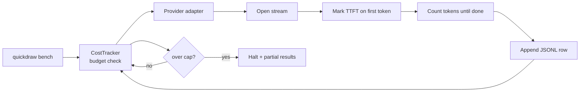

# Quickdraw

**Benchmark LLM streaming. TTFT, TPS, $/1K tokens. Across providers, on your prompts, with a hard cost ceiling.**

[](https://npmjs.com/package/@ykstorm/quickdraw)
[](https://github.com/ykstorm/quickdraw/actions/workflows/ci.yml)
[](LICENSE)
[](https://quickdraw.lakshyaraj.dev)

Live dashboard with fresh numbers every morning: **[quickdraw.lakshyaraj.dev](https://quickdraw.lakshyaraj.dev)**

---

## How this started

Week six of homesty.ai. The marketing on Anthropic's site said `claude-haiku-4-5` was faster than `gpt-4o-mini`. I'd been on gpt-4o-mini since launch. The pricing was comparable. The latency claim was the only reason to consider switching.

I switched. Two days of live traffic later, p50 perceived latency had gone UP by about 80ms. Buyers were noticing. I opened our streaming logs and realized the issue: total latency was lower on Claude, but the chunk shape was different. Claude was sending fewer, larger chunks — TTFT was actually worse, and on mobile the perceived feel was choppier even though total bytes arrived sooner.

I'd trusted marketing copy without measuring. The TTFT graph my eye actually cared about wasn't on any vendor's docs page.

Quickdraw is the toolkit I built so I wouldn't have to trust marketing again.

---

## What it measures

| Metric | What it means | Why care |
|---|---|---|
| **TTFT p50/p95** | Time to first streamed token | UX feel — perceived latency |
| **TPS** | Tokens per second once streaming starts | Throughput for long answers |
| **Chunk shape** | Mean tokens per SSE event | Smoothness on mobile vs desktop |
| **Cold latency** | First call after 60s idle | Cold-start tax for serverless |
| **Guardrail overhead** | Extra latency with a guard in the loop | Cost of safety |
| **$/1K out tokens** | Real dollar cost, ledgered per call | Your actual spend, not marketing rate |

---

## When to use Quickdraw and when not to

| You want this | Use |
|---|---|
| TTFT/TPS measured on your prompts, from your region, on any provider | Quickdraw |
| Eval correctness of LLM outputs (golden dataset, judge) | [Goldset](https://goldset.lakshyaraj.dev) |
| Production observability of every LLM call | Helicone, LangFuse |
| Model quality benchmarks (MMLU, HELM, MT-Bench) | Standard harnesses |
| LLM router / gateway with auto-failover | LiteLLM, Portkey |

Quickdraw is for "should I switch providers?" decisions. It's not a router or a load balancer or an output validator. Pair it with Goldset when you want both speed AND correctness in one PR check.

---

## 60-second quickstart

```bash
npm install -g @ykstorm/quickdraw
export OPENAI_API_KEY=sk-...
export ANTHROPIC_API_KEY=sk-ant-...

quickdraw bench --providers openai,anthropic --runs 5 --prompt-file ./prompts/your-prompt.md
```

Output:
```
Provider     Model              TTFT p50   TTFT p95   TPS    Chunk size   Cost/1K out
openai       gpt-4o-mini        289 ms     412 ms     78.2   8 tok        $0.0006
anthropic    claude-haiku-4-5   541 ms     720 ms     91.4   16 tok       $0.0010
openai       gpt-4o             520 ms     714 ms     54.7   12 tok       $0.0150
```

Results land in `./results/run-<timestamp>.json`. Cost ledger appends to `./api_calls.jsonl`. Run halts before exceeding `--cost-cap` (default $2).

---

## The cost ceiling — why this matters

I once accidentally looped a benchmark in a Bash for-loop and woke up to a $42 OpenAI charge. Eight hours of `gpt-4o` calls. My fault for not thinking through the loop, but easy fault to make.

Quickdraw enforces a hard cap, before the next call would breach. Set `--cost-cap=2.00` and the runner halts at $1.97 with partial results written. The kind of feature you wish existed the first time you needed it.

Pair with a provider-side cap (OpenAI Usage limits / Anthropic spend limits per key) as belt-and-suspenders.

---

## Run nightly, publish a public dashboard

```yaml
# .github/workflows/nightly-bench.yml
- uses: ykstorm/quickdraw-bench-action@v1
  with:
    providers: openai,anthropic,bedrock
    runs: 10
    prompt-file: ./bench/standard-prompt.md
    cost-cap: 5.00
    publish-to: gh-pages
```

GitHub Pages serves the static dashboard at `your-site.github.io/quickdraw-results/`. That's how [quickdraw.lakshyaraj.dev](https://quickdraw.lakshyaraj.dev) works — a single Action that runs at 01:00 UTC, writes results to gh-pages, no backend, no SaaS.

---

## What I'd build differently next time

- **Sample variance is bigger than I thought.** Run count should default to 20, not 5. The TTFT distribution is fat-tailed — 5 runs can lie. v1.1 will bump the default.
- **Don't measure from one region.** Multi-region runs (US-East vs Mumbai vs Singapore) tell you what your actual users see. v1.1 adds region rotation.
- **The cost estimator is wrong on tool-use responses.** Function-calling counts arg tokens too, which the current estimator misses. v1.0.1 will fix.

If you're using Quickdraw to make a switch-provider decision today, run 20 cycles per provider and check the p95, not the p50.

---

## How it compares

| | Quickdraw | OpenAI Eval | LangSmith | LiteLLM | rolling-your-own |
|---|---|---|---|---|---|
| TTFT measured separately from total latency | ✅ | ❌ | ✅ | partial | depends |
| Provider-agnostic | ✅ | ❌ | partial | ✅ | n/a |
| Hard cost ceiling | ✅ | ❌ | ❌ | ❌ | up to you |
| Nightly public dashboard from GH Action | ✅ | ❌ | paid tier | ❌ | up to you |
| Single-binary CLI | ✅ | ❌ | ❌ | ✅ | n/a |
| License | Apache 2.0 | proprietary | proprietary | MIT | n/a |

If you only need cost tracking, LangSmith does it (paid). If you need TTFT specifically and a CLI you can ship to CI, Quickdraw is what's open and free.

---

## Architecture



Components map: [docs/architecture.md](docs/architecture.md).

---

## Roadmap

- [x] v1.0 — OpenAI + Anthropic providers, CLI + library, cost ceiling, JSON Lines ledger, GH Pages dashboard
- [ ] v1.0.1 — fix tool-use cost estimator
- [ ] v1.1 — default runs 20 instead of 5, multi-region rotation
- [ ] v1.2 — Bedrock + Vertex + Mistral providers, Ollama local adapter
- [ ] v1.3 — continuous mode (long-running daemon, time-series chart)

---

## Tests + CI

```bash
npm test
DRY_RUN=true npm run bench:dry
```

CI runs lint → typecheck → tests → docker build → dry-run bench. Nightly Action runs a real bench against allowlisted providers and publishes to gh-pages.

---

## Limits

- Not a model quality benchmark. HELM/MMLU/MT-Bench for that.
- Not a regression-blocker. Pair with [Goldset](https://goldset.lakshyaraj.dev) for that.
- Streaming-format adapters only for OpenAI SSE and Anthropic at v1.0. Bedrock and Vertex land in v1.2.

---

## License

Apache License 2.0 — see [LICENSE](LICENSE).

## Provenance

Built to answer a single question at [homesty.ai](https://homesty.ai): when we switched providers, did p50 TTFT actually improve, or did I just trust marketing? Quickdraw gave the answer in 4 minutes (turns out: I was wrong). Now the same toolkit publishes daily numbers across providers, no SaaS, no account.

## Author

**Lakshyaraj Singh Rao** — Full-Stack Engineer · AI Systems · Backend · DevOps
Mumbai, India

[lakshyaraj.dev](https://lakshyaraj.dev) · [@ykstorm](https://github.com/ykstorm) · [LinkedIn](https://linkedin.com/in/lakshyaraj) · raolakshyaraj@gmail.com
