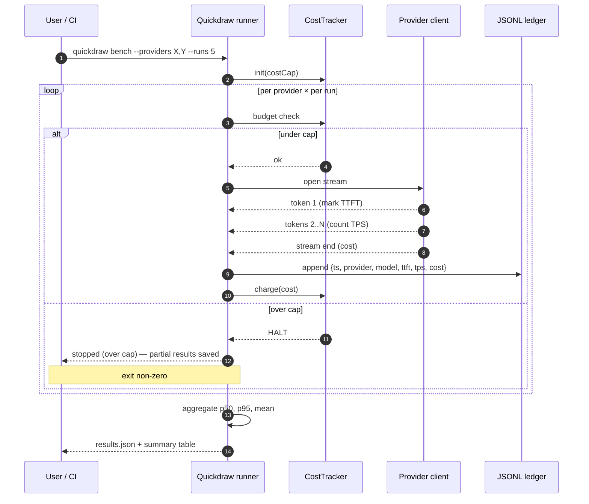

# Quickdraw — Architecture

## Run flow



## Components

| Module | Path | Responsibility |
|---|---|---|
| Runner | `src/runner.ts` | Orchestrates passes, aggregates results |
| CostTracker | `src/cost.ts` | Per-call cost accounting + cap enforcement |
| APICallLogger | `src/logger.ts` | JSON Lines ledger writer |
| Provider adapters | `src/providers/*` | One file per provider — Anthropic, OpenAI, Bedrock |
| Dashboard generator | `src/dashboard.ts` | Static HTML from results/*.json |
| CLI | `bin/quickdraw.ts` | commander-based entry point |

## Why JSON Lines (not CSV, not Parquet)

- Append-only, crash-safe (partial line is recoverable)
- Streamable (you don't need to load the whole file to scan recent calls)
- Pipeable (`tail -f api_calls.jsonl | jq` works without setup)
- Human-readable on `cat`
- One row per call, no header drift between schema versions

## Cost ceiling implementation

```ts
// Pseudocode
class CostTracker {
  spent = 0
  cap: number
  charge(usd: number): 'ok' | 'over_cap' {
    if (this.spent + usd > this.cap) return 'over_cap'
    this.spent += usd
    return 'ok'
  }
}
```

Called **before** the API call (pessimistic — assume max output). Refund the difference after the call completes (actual output tokens ≤ max). This eliminates the "I expected $1.99, hit $2.04" overshoot pattern.

## Provider adapter interface

```ts
interface Provider {
  name: string
  modelDefault: string
  estimateCost(input: number, output: number, model: string): number
  stream(prompt: string, model: string): AsyncIterable<{ token: string; finished: boolean }>
}
```

Drop a file in `src/providers/foo.ts`, register in `src/providers/index.ts`, you support a new provider. PR-friendly.

## What runs in CI vs locally

- **CI (GitHub Actions)** — DRY_RUN mode (no API key needed) + nightly real bench on schedule, with a separate budget cap and a separate API key set
- **Locally** — real runs against your own keys, full output to `./results/`

CI never sees the production API key. CI nightly uses a separate `OPENAI_API_KEY_BENCH` secret with a low daily cap on the OpenAI side as a second safety net.
